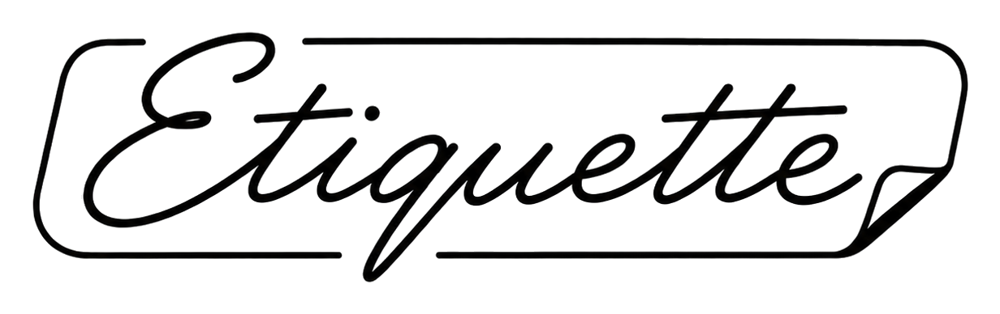

<p align="center"></p>

# Etiquette

**Open-source label design and printing** — an alternative to proprietary
label suites, built on a format you already own: SVG.

*Étiquette* is French for "little label" — it's where the English word comes
from. Labels that follow etiquette.

## Why

Commercial label software locks three things behind one license: the
designer, the print engine, and your own label files. Etiquette splits them
apart:

- **A label template is a plain `.svg`** following a small documented
  convention ([docs/convention.md](docs/convention.md)) — it previews in a
  browser, diffs in git, and emails to a customer as-is. Any SVG editor can
  touch it.
- **Design** in `etiqedit`, a purpose-built WinForms designer: canvas with
  snapping, groups and layers, inline text editing, a context-aware
  inspector, and a metadata editor for data fields, lookup maps, and
  embedded pick lists.
- **Printing** happens straight from the designer (or the `etiq` CLI):
  merge data into the template, generate barcodes, print via any Windows
  printer driver — plus a ZPL raster path for thermal printers.

## What it does today (v0.5)

- **Barcodes, dependency-free:** Code 128, Code 39 (+extended), QR
  (versions 1–40, all ECC levels), DataMatrix (ECC200), PDF417 — every
  encoder decode-verified against two independent readers. QR supports a
  center **logo overlay** with geometry tuned so codes stay scannable.
- **Data-driven templates:** fields resolved from prompts, embedded pick
  lists, composition (with conditional variants — e.g. international
  address ordering), lookup maps, serial counters, dates, and REST
  sources. One resolver, used everywhere.
- **Print station:** a data-entry mode with searchable pickers, live
  preview, single/batch printing with collation control.
- **Reusable metadata templates (snippets):** ship-with defaults include a
  US address block and a country-aware international address block
  (~35 countries), plus save-your-own.
- **WYSIWYG by construction:** the canvas, the print preview, and the
  printed page share one renderer.

See [docs/roadmap.md](docs/roadmap.md) for where it's headed.

## Building

.NET 8 SDK. The designer is Windows (WinForms); the core libraries and
tests are cross-platform.

```
dotnet build Etiquette.sln          # everything
dotnet run --project tests/Etiq.Tests   # test suite (no test framework needed)
dotnet publish src/Etiq.Editor -c Release -r win-x64 -p:PublishSingleFile=true --self-contained
```

Open `Etiquette.sln` in Visual Studio and run `Etiq.Editor` for the
designer. Releases are published on this repository's Releases page; the
designer checks it for updates (Help → Check for Updates).

## Repository layout

| Piece | Purpose |
|---|---|
| `docs/convention.md` | The Etiquette SVG label convention (the format spec) |
| `docs/counters.md` | Atomic serial counters on stock Epicor Kinetic features |
| `src/Etiq.Core` | Template model, validator, field resolver, barcode encoders, ZPL raster, PDF/PNG helpers |
| `src/Etiq.Editor.Core` | Editor document model (XML-is-the-model, undo, geometry) |
| `src/Etiq.Editor` | `etiqedit` — the WinForms designer + print engine |
| `src/etiq` | CLI: validate, resolve, batch |
| `tests/Etiq.Tests` | Dependency-free test runner (also `--dump-barcodes` for external decode verification) |
| `examples/` | Synthetic sample templates |
| `snippets/` | Shipped metadata templates |

BarTender `.btw` import lives in a separate private repository
(`etiquette-btw`) and is picked up by a conditional project reference when
cloned alongside; this repository builds and runs fully without it. See
[PROVENANCE.md](PROVENANCE.md).

## Data hygiene

Label files and previews may contain customer data (part numbers,
addresses, serials). Do not commit real production label files to a public
repository — `examples/` is reserved for synthetic samples only.

## License

MIT (see LICENSE). Format documentation in `docs/` is original research for
interoperability purposes.
